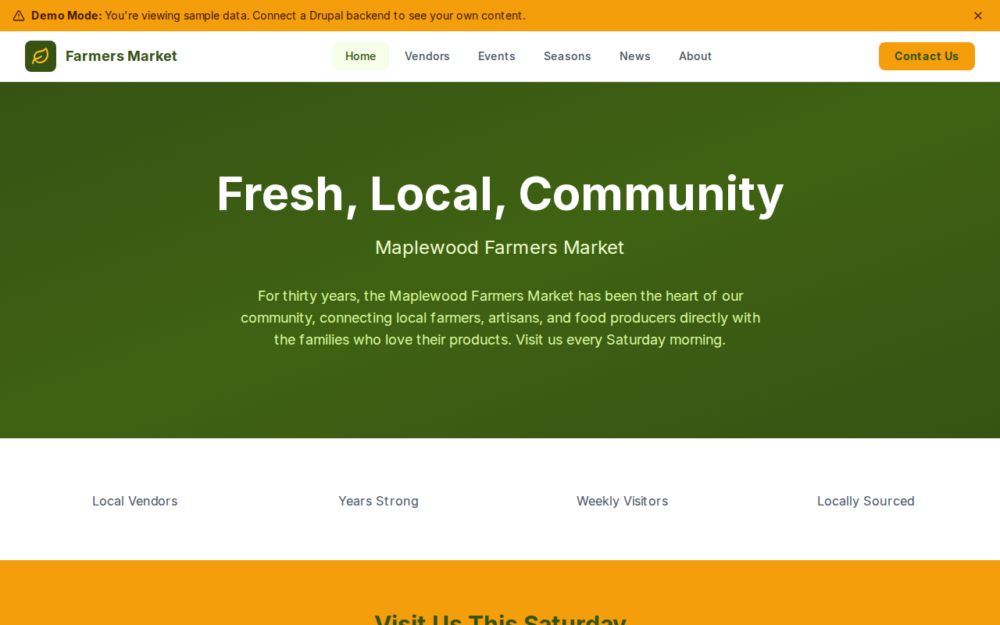

# Decoupled Farmers Market

A community farmers market website starter template for Decoupled Drupal + Next.js. Built for farmers markets, food cooperatives, and local food organizations.



## Features

- **Vendor Directory** - Showcase local farmers, bakers, artisans, and food producers with booth locations and product offerings
- **Market Events** - Promote festivals, workshops, seasonal celebrations, and community gatherings
- **Seasonal Schedules** - Display outdoor, indoor, and holiday market hours and dates
- **Market News** - Share announcements, vendor spotlights, and community programs
- **Modern Design** - Clean, accessible UI optimized for farmers market content

## Quick Start

### 1. Clone the template

```bash
npx degit nextagencyio/decoupled-farmers-market my-farmers-market
cd my-farmers-market
npm install
```

### 2. Run interactive setup

```bash
npm run setup
```

This interactive script will:
- Authenticate with Decoupled.io (opens browser)
- Create a new Drupal space
- Wait for provisioning (~90 seconds)
- Configure your `.env.local` file
- Import sample content

### 3. Start development

```bash
npm run dev
```

Visit [http://localhost:3000](http://localhost:3000)

---

## Manual Setup

<details>
<summary>Click to expand manual setup steps</summary>

### Authenticate with Decoupled.io

```bash
npx decoupled-cli@latest auth login
```

### Create a Drupal space

```bash
npx decoupled-cli@latest spaces create "My Farmers Market"
```

Note the space ID returned. Wait ~90 seconds for provisioning.

### Configure environment

```bash
npx decoupled-cli@latest spaces env 1234 --write .env.local
```

### Import content

```bash
npm run setup-content
```

This imports:
- Homepage with hero, stats, featured vendors, and CTA
- 5 Vendors (Morning Glory Farm, Hearth & Stone Bakery, Meadow Creek Dairy, Oak Hill Meats, Wildwood Flowers)
- 3 Market Events (Spring Opening Day, Canning Workshop, Fall Harvest Festival)
- 3 Market Seasons (Outdoor, Winter Indoor, Holiday Market)
- 3 News Articles (New Vendors, SNAP Program, Music Lineup)
- 2 Static Pages (About, Become a Vendor)

</details>

## Content Types

### Vendor
- **vendor_type**: Category (Produce, Bakery, Dairy, Meat & Poultry, etc.)
- **products**: Description of products offered
- **location_number**: Booth or stall number at the market
- **website_url**: Vendor website
- **image**: Vendor photo
- **featured**: Whether the vendor is featured on the homepage

### Event
- **event_date / end_date**: Event start and end times
- **location**: Event location
- **event_type**: Category (Festival, Workshop, Family, Music, etc.)
- **image**: Event promotional image

### Season
- **start_date / end_date**: Season date range
- **hours**: Operating hours during the season
- **image**: Seasonal photo

### News
- **image**: Featured image
- **category**: News category (Announcement, Community, Vendor Spotlight, etc.)
- **featured**: Whether the article is featured

## Customization

### Colors & Branding
Edit `tailwind.config.js` to customize colors, fonts, and spacing.

### Content Structure
Modify `data/farmers-market-content.json` to add or change content types and sample content.

### Components
React components are in `app/components/`. Update them to match your design needs.

## Demo Mode

Demo mode allows you to showcase the application without connecting to a Drupal backend.

### Enable Demo Mode

```bash
NEXT_PUBLIC_DEMO_MODE=true
```

### Removing Demo Mode

1. Delete `lib/demo-mode.ts`
2. Delete `data/mock/` directory
3. Delete `app/components/DemoModeBanner.tsx`
4. Remove `DemoModeBanner` from `app/layout.tsx`
5. Remove demo mode checks from `app/api/graphql/route.ts`

## Deployment

### Vercel (Recommended)
[](https://vercel.com/new/clone?repository-url=https://github.com/nextagencyio/decoupled-farmers-market)

### Other Platforms
Works with any Node.js hosting platform that supports Next.js.

## Documentation

- [Decoupled.io Docs](https://www.decoupled.io/docs)
- [Next.js Documentation](https://nextjs.org/docs)
- [Drupal GraphQL](https://www.decoupled.io/docs/graphql)

## License

MIT
